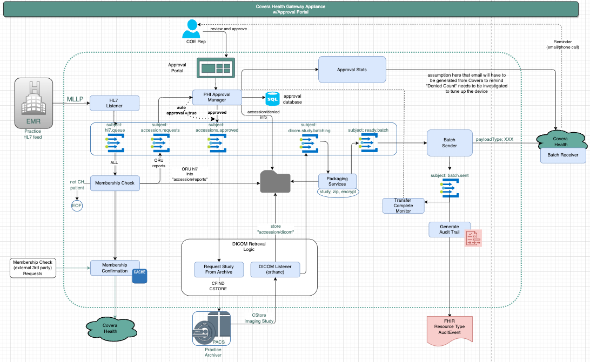
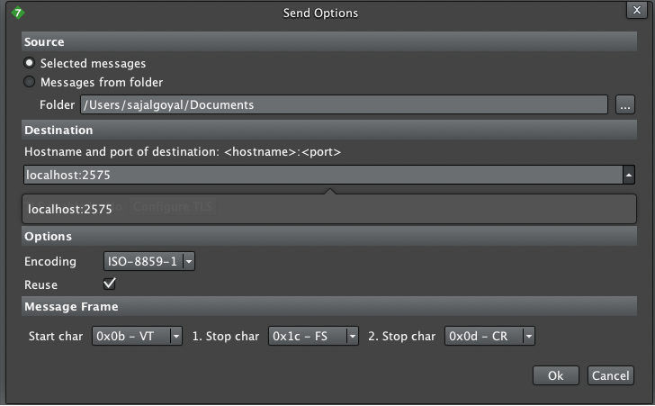
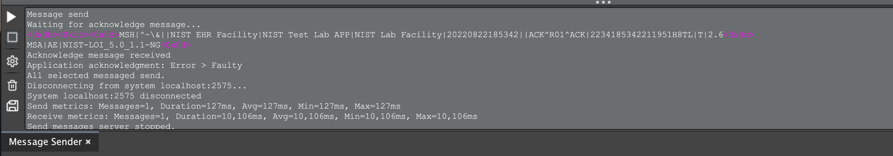

# gateway-hl7-listener
This is a Python service that does the following:
* Listen/receive MLLP HL7 messages from the configured port.
* Publish (NATS Publish-Subscribe mode) the received HL7 messages to the configured NATS JetStream server "Subject" (e.g., "hl7.<subject-name>").
Note that the "Subject" is associated with a JetStream "Stream" (e.g., "hl7") and the stream's "Consumer" (e.g.,"queue").
* The published NATS messages are acknowledge by the server. If messages publishes start to fail or acknowledges do not occur, listening for HL7 messages will halt.

Diagram: 


## Development

### Setup

```bash
poetry install # Create venv and install dependencies

poetry run pytest # Run unit tests

poetry build -f wheel # Build the wheel file under dist directory
```

Update `pyproject.toml` as needed.

```bash
poetry update # update the poetry.lock file after making changes to pyproject.toml
```

### Adding Dependencies

Update the `pyproject.toml` file to add dependencies.

### Install NATS Jetstream server and NATS CLI

You can find the instructions for the NATS Jetstream server (via docker) here:
https://hub.docker.com/_/nats/

You can find the instructions for the NATS Cli here:
https://github.com/nats-io/natscli

A `docker-compose` file is also available for standing up NATS Jetstream server.

### Create the stream and consumer

Create the hl7 stream with wildcard/unspecified subjects:

```bash
nats str add hl7 --subjects "hl7.*" --ack --max-msgs=-1 --max-bytes=-1 --max-age=1y --storage file --retention limits --max-msg-size=-1 --discard=old --max-msgs-per-subject=-1 --dupe-window=2m --replicas=1
```

Create the queue consumer for the hl7 stream and filter to a subject named "hl7.queue":

```bash
nats con add hl7 queue --filter hl7.queue --ack explicit --pull --deliver all --max-deliver=-1 --sample 100 --max-pending=1 --replay=instant --wait=1s
```
### Environment variables

You will need to override these if you are not running locally.

HL7_MLLP_HOST = HL7 MLLP host server

HL7_MLLP_PORT = HL7 MLLP host server port to listen for incoming HL7 messages

NATS_OUTGOING_SUBJECT = NATS subject to use

NATS_SERVER_URL = NATS Jetstream connection info

### Creating the docker image

Create the container using the docker build command below.

```bash
docker build -t chip-gateway-hl7-listener:1.0.0 .
```

If the steps completed successfully, the image specified by the -t option should now exist.

### Testing

Install nats cli
```bash
brew tap nats-io/nats-tools
brew install nats-io/nats-tools/nats
```

Set local context
```bash
nats context add local --description "Localhost"
nats context ls
nats context select local
```

Start the services
```bash
docker-compose up
```

Create a stream (hl7) and a consumer (hl7.queue) for that stream
```bash
nats str add hl7 --subjects "hl7.*" --ack --max-msgs=-1 --max-bytes=-1 --max-age=1y --storage file --retention limits --max-msg-size=-1 --discard=old --max-msgs-per-subject=-1 --dupe-window=2m --replicas=1

nats con add hl7 queue --filter hl7.queue --ack explicit --pull --deliver all --max-deliver=-1 --sample 100 --max-pending=1 --replay=instant --wait=1s
```

Send a sample HL7 using `HL7 Inspector` tool. Samples are available under `src/test/resources`. Import a sample fine in Hl7 inspector. Set the send option to the following:



Hit the send button and confirm success in the logs: 


Confirm the message was processed by the service and sent to hl7.queue consumer ("Unprocessed Messages": 1)
```bash
nats con info hl7 queue
```

